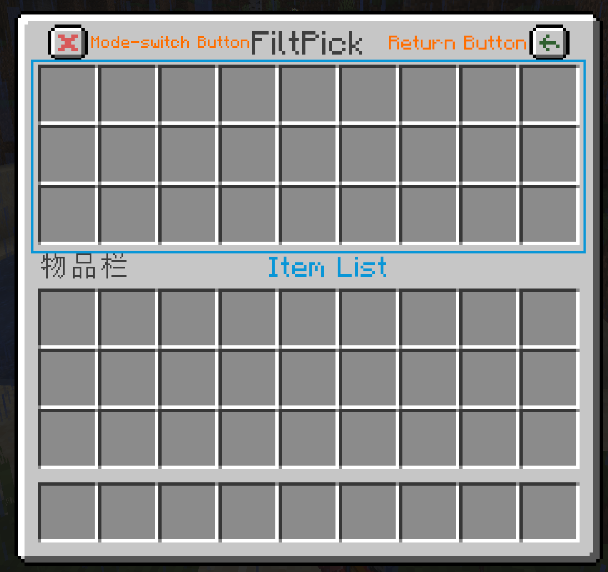

# FiltPick

[](https://www.curseforge.com/minecraft/mc-mods/filtpick)
[](https://modrinth.com/mod/filtpick)

This is a forge mod for Minecraft which enables you to pick up items selectively. 
It's a lightweight mod and has a user-friendly interface.
If you need fabric port, please click [here](https://github.com/APeng215/FiltPick).

## How to Install

1. [Download](https://modrinth.com/mod/filtpick/versions) the Jar File of proper version.
2. Copy or cut the jar file you've just downloaded to your mod path (usually ".../.minecraft/mods" or ".../.minecraft/versions/\<versionName>/mods")
3. Make sure you have installed forge of proper version.

## How to use

Actually, the UI is too straightforward to require any guidance. I recommend trying yourself __directly in game__.

- Put the item into the list, the function will take effect automatically.
- Whitelist-mode: Only the items below will be picked up
- Blacklist-mode: The items below won't be picked up




### Configure button position

You can configure button position in `/config/filtpick.json`.<br>
_Normally, there is no necessity to make any configuration except for mods conflicts._

## For developer

If you want to build the source project, 
remember to delete the proxy settings in file `gradle.properties`.
```
# Used for proxy of the author, delete it if you are not the author.
systemProp.http.proxyHost=127.0.0.1
systemProp.http.proxyPort=10809
systemProp.https.proxyHost=127.0.0.1
systemProp.https.proxyPort=10809
```

## Credits

### Localization

- 日本語 - [Dulroy](https://space.bilibili.com/313723598)

## Release Pages

- [CurseForge](https://www.curseforge.com/minecraft/mc-mods/filtpick)  
- [Modrinth](https://modrinth.com/mod/filtpick)
- [GitHub](https://github.com/APeng215/FiltPick)
- [MC百科](https://www.mcmod.cn/class/8081.html)
- [MCBBS](https://link.mcmod.cn/target/aHR0cHM6Ly93d3cubWNiYnMubmV0L3RocmVhZC0xNDcyMjE5LTEtMS5odG1s)

